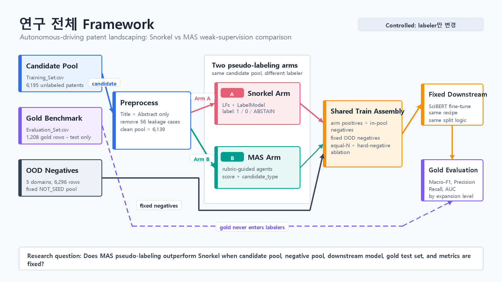
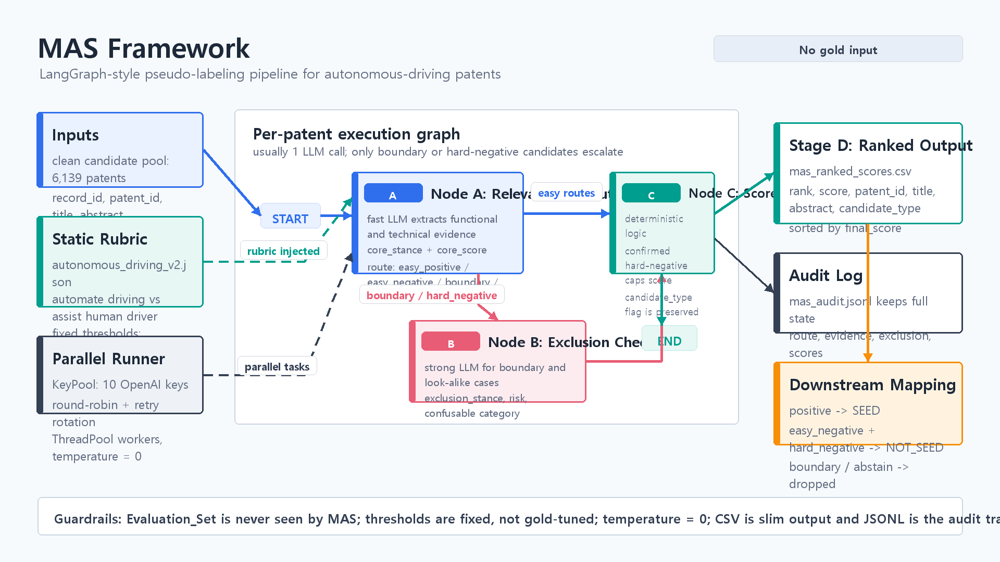

# A Multi-Agent Weak Supervision Framework for Domain-Relevant Patent Identification

Suin Lee, Woojin Choi, Seoyoung Moon, and Jungmin Yoo

Seoul National University

## Abstract

Patent landscaping begins with the practical problem of identifying patents that are relevant to a target technological domain. Keyword and CPC-based search strategies can retrieve broad candidate pools, but they often have low precision and require repeated expert adjustment. Recent weak-supervision approaches reduce manual labeling by combining heuristic labeling functions, but their performance depends strongly on hand-designed domain rules. This paper proposes a multi-agent weak supervision framework that replaces Snorkel-style keyword labeling with rubric-guided large language model agents for pseudo-labeling domain-relevant patents. The framework uses a Relevance and Route agent, a conditional Exclusion agent, and a deterministic scoring step to assign each patent a score and candidate type. We evaluate the framework on six technology domains from Bergeaud and Verluise: self-driving vehicles, additive manufacturing, blockchain, computer vision, genome editing, and hydrogen storage. For each domain, Snorkel and the proposed MAS label the same candidate pool, the resulting labels are used to fine-tune the same SciBERT classifier, and performance is measured on a held-out gold benchmark. Across all six domains, MAS-labeled training data improves average AUC from 0.881 to 0.945, Macro-F1 from 0.730 to 0.833, recall from 0.551 to 0.781, precision from 0.718 to 0.783, and accuracy from 0.821 to 0.883. The results suggest that agentic reasoning improves weak supervision by mining in-domain hard negatives that keyword labeling functions fail to express.

## 1 Introduction

Patent landscaping analysis provides a structured view of the patent activity surrounding a scientific or technological domain. Its first and often most consequential step is patent identification: deciding which documents are actually relevant to the domain of interest. If this initial set is noisy, incomplete, or irreproducible, later analyses of technological trajectories, competitive positioning, and research opportunities inherit that error.

Traditional patent identification relies on combinations of keywords, IPC or CPC codes, and expert-crafted Boolean queries. These approaches are attractive because they are transparent and easy to execute at scale, but they are expensive to refine and often return broad candidate sets with limited precision. Machine learning methods can learn richer decision boundaries, but they normally require labeled training data. In domain-specific patent landscaping, such labels are costly because a patent may contain domain vocabulary while still not performing the target technological task.

Weak supervision addresses this bottleneck by creating training labels from noisy programmatic sources rather than manual annotation. Sofean's patent identification pipeline uses Snorkel to combine labeling functions and then fine-tunes SciBERT on the resulting training set. However, Snorkel shifts part of the burden from manual labeling to manual rule design: high-performing labeling functions still require domain knowledge, careful boundary definitions, and iterative engineering. This limitation is especially visible when the positive signal is not a keyword but a functional task, such as whether a vehicle actually automates driving or merely assists a human driver.

This paper asks whether a multi-agent system can serve as a more scalable weak-supervision labeler for domain-relevant patent identification. The proposed framework uses rubric-grounded agents to reason over patent titles and abstracts, identify positive cases, separate easy negatives from hard negatives, and produce pseudo-labels for downstream SciBERT training. The experimental design holds the downstream model, evaluation data, and metrics fixed; only the labeling mechanism changes.

The study is organized around two research questions. RQ1 asks whether the proposed MAS-generated training data improves patent identification performance relative to a Snorkel weak-supervision baseline. RQ2 asks whether the framework generalizes across multiple technology domains rather than only one carefully engineered case. The empirical answer to both questions is positive: MAS outperforms Snorkel across all six evaluated domains, with the largest average gain appearing in recall.

## 2 Related Work

Patent landscaping and patent identification. Patent landscaping has been used to assess technology trends, R&D investment, and competitive landscapes. A central problem in this process is the construction of a relevant patent set. Early and rule-based approaches use search formulas that combine keywords with classification codes. Such formulas are transparent but can be brittle: CPC classes are organized around technical features rather than a researcher's functional domain, and keyword matches often capture background mentions or adjacent technologies.

Automated patent landscaping. Abood and Feltenberger introduced automated patent landscaping as a machine-learning approach to expanding from representative seed patents. Bergeaud and Verluise advanced this line of work by defining six frontier technology domains at the functional-application level and constructing seed and anti-seed benchmarks. Their framing is important for the present study because a patent is not positive merely because it matches a keyword or CPC rule; it is positive when the invention performs one of the domain's defining tasks.

Weak supervision and Snorkel. Snorkel provides a framework for training data creation through labeling functions. Instead of asking experts to label every data point, experts write heuristic functions that vote on labels, and a generative label model combines their overlapping and conflicting outputs. In patent identification, this approach can reduce direct annotation costs, but it still depends on the quality and coverage of the labeling functions. When the boundary is semantic rather than lexical, keyword functions may over-label candidate pools as positive.

Large language models and agentic labeling. Large language models can judge semantic relevance from natural language descriptions, but direct single-call classification is hard to audit and can be expensive. The framework proposed here uses a constrained multi-agent design instead: a first agent extracts evidence and routes cases, a second agent checks exclusions only when necessary, and a deterministic scoring step maps the structured state into candidate types. This preserves auditability while allowing the labeler to express distinctions that are difficult to encode as static keyword rules.

## 3 Methods

The pipeline compares two labelers under controlled downstream conditions. The input to both labelers is the same title-and-abstract candidate set. The output of each labeler is transformed into a binary SciBERT training set, where SEED denotes a domain-relevant patent and NOT_SEED denotes an irrelevant or excluded patent. SciBERT is then fine-tuned with identical hyperparameters and evaluated on the same held-out gold set.

Data and domains. We evaluate six domains drawn from Bergeaud and Verluise: self-driving vehicles, additive manufacturing, blockchain, computer vision, genome editing, and hydrogen storage. For each domain, the gold benchmark contains manually labeled SEED and NOT_SEED examples. Candidate pools are collected using the domain's official CPC-prefix and keyword search query. For each domain, we also attach the other five domains' gold sets as out-of-domain candidates, which allows the labelers to show whether they can reject clearly different technologies.

Snorkel baseline. The Snorkel arm uses labeling functions and a LabelModel. Self-driving vehicles use a bespoke set of positive and negative labeling functions because the domain has a known automate-versus-assist boundary. The remaining five domains use generic keyword-based labeling functions derived from the domain keyword lists. This design represents a realistic weak-supervision baseline: it is scalable and domain-parameterized, but its ability to create in-domain negative examples is limited when candidate pools are already selected by keyword and CPC rules.

MAS labeler. The MAS arm uses a domain rubric rather than hand-written labeling functions. For non-self-driving domains, rubrics are generated from the domain's functional tasks, keyword signals, and hard-negative concept. Self-driving vehicles use a manually specified rubric that emphasizes the distinction between automating driving and assisting a human driver. For each patent, Node A extracts functional and technical evidence, assigns a relevance score, and routes the case as easy_positive, easy_negative, boundary, hard_negative, or abstain_candidate. Node B runs only for boundary or hard-negative cases and checks whether the patent should be excluded as a look-alike. Node C applies deterministic rules to produce a final score and a candidate type.

Downstream training. Positive MAS cases are mapped to SEED. Easy-negative and hard-negative MAS cases are mapped to NOT_SEED, while boundary and abstain cases are dropped. Snorkel labels are mapped directly from SEED, NOT_SEED, and ABSTAIN. In all experiments, the downstream classifier is allenai/scibert_scivocab_uncased with a maximum sequence length of 256, four epochs, learning rate 2e-5, batch size 16, weight decay 0.01, a 10 percent validation split, and class-weighted loss.

Evaluation. The primary metrics are AUC, Macro-F1, recall, precision, and accuracy on each domain's held-out gold benchmark. Macro-F1 is important because the evaluation sets are imbalanced. Recall is also central in patent landscaping because missing relevant patents can distort downstream analyses of a technological field.

## 4 Experiments and Results

The experiment covers 7,498 gold evaluation patents and 36,550 in-domain labeling candidates across six technologies. After OOD augmentation, the labelers process 74,068 candidate records in total. The gold sets are used only for final evaluation and are not supplied to either Snorkel or MAS.

The first diagnostic result concerns the labelers' behavior before downstream fine-tuning. Snorkel labels most in-domain candidate pools as positive because the candidate pools were themselves built from domain keywords and CPC classes. In the five non-self-driving domains, it creates no in-domain NOT_SEED examples. MAS, by contrast, produces substantial in-domain negative sets by identifying rule-matched but task-irrelevant patents as hard negatives. Across all domains, MAS assigns 24,314 in-domain candidates to positive, 11,612 to negative, and 622 to boundary or abstain. Snorkel assigns 33,471 in-domain candidates to SEED, only 1,385 to NOT_SEED, and 1,694 to ABSTAIN.

Downstream performance confirms the importance of this labeling difference. MAS improves average AUC from 0.881 to 0.945, Macro-F1 from 0.730 to 0.833, recall from 0.551 to 0.781, precision from 0.718 to 0.783, and accuracy from 0.821 to 0.883. MAS is better than Snorkel on AUC, Macro-F1, and accuracy in every domain. It also improves recall and precision in five of six domains.

The largest gains appear in domains where Snorkel's keyword rules create an especially one-sided training signal. Blockchain, computer vision, and genome editing show large Macro-F1 gains. For blockchain, Macro-F1 increases from 0.687 to 0.880 and recall from 0.353 to 0.955. For genome editing, Macro-F1 increases from 0.696 to 0.941. These improvements indicate that MAS pseudo-labels help SciBERT learn a decision boundary rather than only a domain vocabulary.

## 5 Discussion

The results support the claim that multi-agent reasoning can improve weak supervision in patent identification. Snorkel is effective when good labeling functions exist, but the effort required to write those functions grows with the number and subtlety of domains. MAS shifts that effort into a structured rubric and evidence-extraction process. This is not a replacement for domain definition: the model still needs a clear description of the target technology. However, it reduces the need to translate that definition into brittle keyword rules.

The most important mechanism is hard-negative mining. Bergeaud and Verluise's framework defines technologies at the functional-application level. A patent can match the search query but fail to perform the target task. These cases are exactly what Snorkel keyword rules struggle to reject and what MAS is designed to detect. By supplying SciBERT with many more in-domain negative examples, MAS appears to improve the classifier's boundary between real domain patents and look-alikes.

The framework also generalizes across domains. The six domains vary in vocabulary, evaluation-set balance, and candidate-pool size. MAS improves average performance across all of them, suggesting that the agentic labeler is not simply overfitted to the self-driving case. At the same time, the domain-specific rubrics remain essential: the agents need to know what functional tasks count as in-scope and what kinds of rule-matched patents should be excluded.

Several limitations remain. First, MAS labels are pseudo-labels rather than human annotations; the study evaluates their usefulness through downstream performance, not through a full manual audit of every generated label. Second, the comparison uses a practical Snorkel baseline rather than an exhaustively optimized set of expert-written labeling functions for all six domains. Third, MAS requires LLM calls, which add monetary cost and dependency on model behavior. Finally, all gold sets come from the same underlying benchmark family, so future work should test transfer to additional technologies, patent offices, and time periods.

## 6 Conclusions

This paper proposed a multi-agent weak supervision framework for domain-relevant patent identification. The framework replaces Snorkel's hand-written labeling functions with rubric-guided agents that extract evidence, route cases, check exclusions, and assign candidate types. In a controlled comparison across six technology domains, MAS-labeled training data consistently improved downstream SciBERT performance over Snorkel-labeled training data.

The central empirical finding is that MAS improves recall while maintaining or improving precision. This matters for patent landscaping because the cost of missing relevant patents is high: omissions can distort subsequent analysis of technological scope, competition, and innovation trajectories. By identifying hard negatives and reducing dependence on manually engineered labeling functions, MAS offers a scalable path toward more reproducible and semantically grounded patent identification.

## References

Abood, A., and Feltenberger, D. (2018). Automated patent landscaping. Artificial Intelligence and Law, 26, 103-125.

Bergeaud, A., and Verluise, C. (2023). Identifying technology clusters based on automated patent landscaping. PLOS ONE, 18(12), e0295587.

Ratner, A. J., Bach, S. H., Ehrenberg, H., Fries, J., Wu, S., and Re, C. (2017). Snorkel: Rapid training data creation with weak supervision. Proceedings of the VLDB Endowment, 11(3), 269-282.

Sofean, M. (2026). Identification of domain-relevant patents via weakly supervised deep learning. World Patent Information, 84, 102434.

Trippe, A. (2015). Guidelines for preparing patent landscape reports. World Intellectual Property Organization.

Beltagy, I., Lo, K., and Cohan, A. (2019). SciBERT: A pretrained language model for scientific text. Proceedings of EMNLP-IJCNLP.
